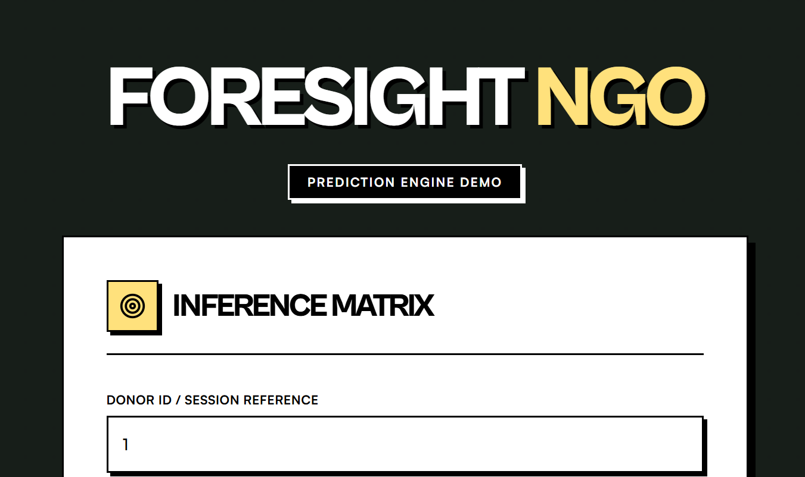
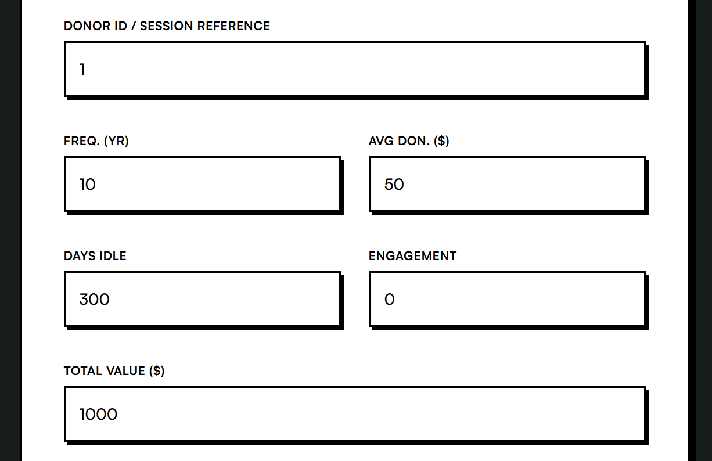
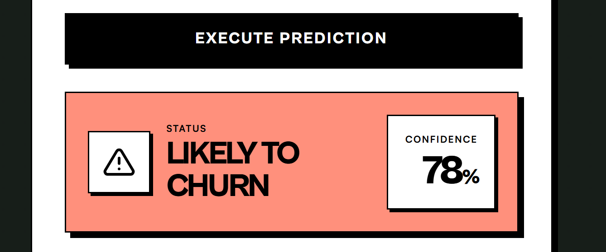
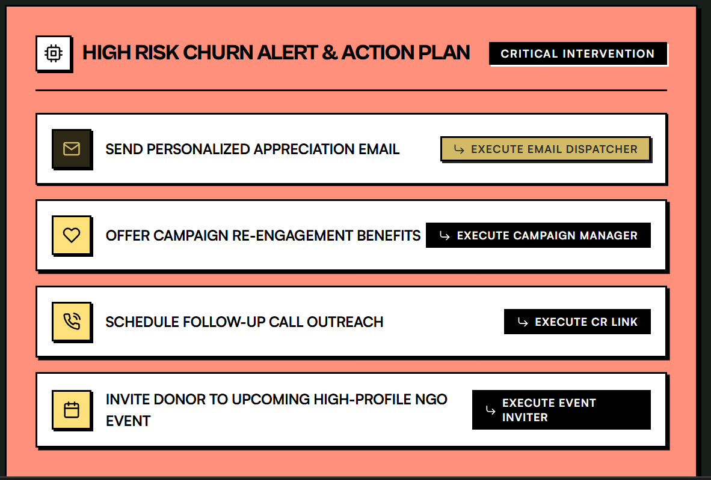
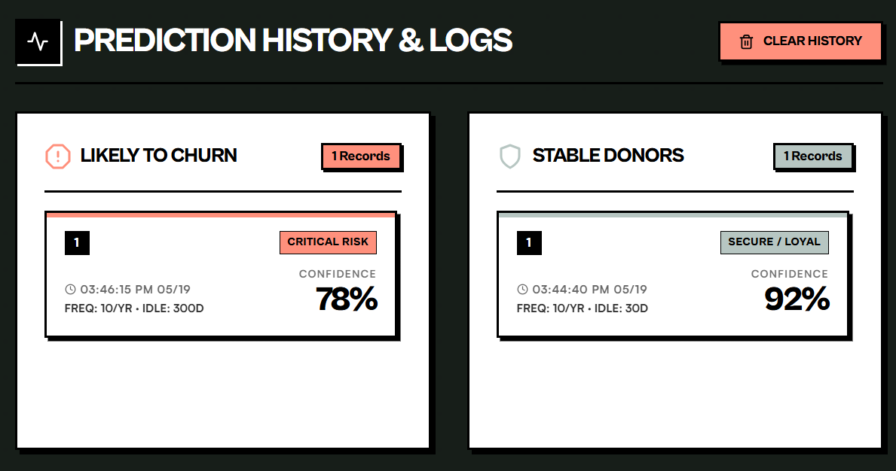

# Foresight-NGO
Machine learning project to predict donor churn using Random forest classifier

# Donor Churn Prediction Dashboard

A full-stack machine learning dashboard that predicts whether donors are likely to stop donating using Random Forest classification.

---

# Features

- Donor churn prediction
- prediction confidence
- action plans
- logs/history
- separate churn/stable sections

---

# Tech Stack

- React
- Flask
- Python
- Scikit-learn
- Pandas

---

# Project Structure

```text
backend/
frontend/
README.md
```

---

# How to Run

## Backend

```bash
cd backend
python app.py
```

## Frontend

```bash
cd frontend
npm start
```

---

# ML Model

Random Forest Classifier used for churn prediction.

---

# Future Improvements

- Better UI
- More accurate models
- Deployment support
- Authentication system

# Screenshots
## Inference Matrix Input



## Donor Input Parameters



## Prediction Result



## Action Plan Dashboard



## Prediction History & Logs




